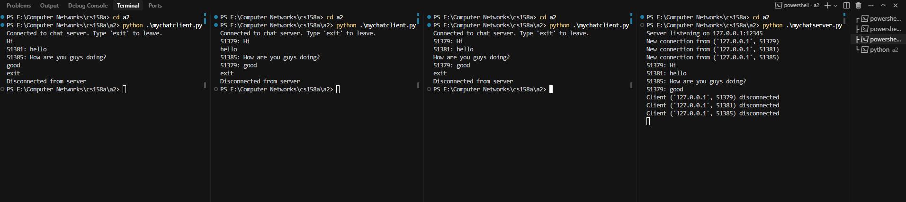

# Chat Server and Client

## How to Run

1. Start the server:
   ```
   python mychatserver.py
   ```

2. Start the client(s):
   ```
   python mychatclient.py
   ```

## Execution Example



### Server
```
Server listening on 127.0.0.1:12345
New connection from ('127.0.0.1', 51044)
New connection from ('127.0.0.1', 51045)
New connection from ('127.0.0.1', 51047)
51044: Hi!
51045: Hello!
51047: How are you guys doing?
51045: Good.
```

### Clients

#### Client 1
```
Connected to chat server. Type 'exit' to leave.
51044: Hi!
Hello! # this is Client 1's input
51047: How are you guys doing?
Good. # this is Client 1's input
exit
Disconnected from server
```

#### Client 2
```
Connected to chat server. Type 'exit' to leave.
Hi! # this is Client 2's input
51045: Hello!
51047: How are you guys doing?
51045: Good.
exit
Disconnected from server
```

#### Client 3
```
Connected to chat server. Type 'exit' to leave.
51044: Hi!
51045: Hello!
How are you guys doing? # this is Client 3's input
51045: Good.
exit
Disconnected from server
``` 