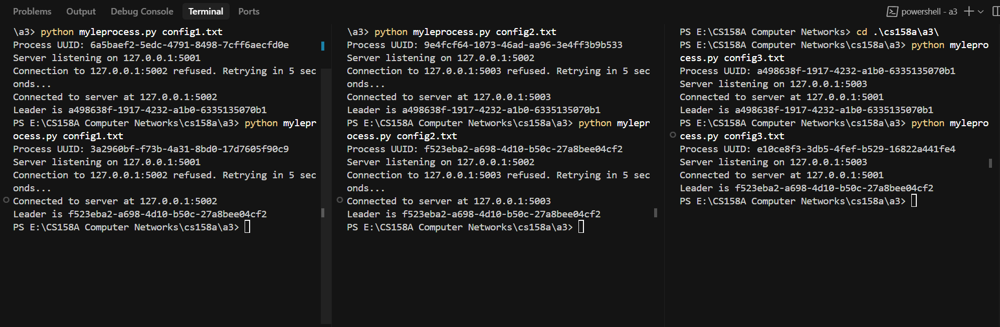

# Leader Election in Asynchronous Ring - CS158A Assignment 3

## 📌 Description
This project implements a leader election algorithm in a unidirectional asynchronous ring using Python sockets and UUIDs. Each process acts as both a client (sending) and server (receiving) and participates in electing the node with the highest UUID as the leader.

- Each node sends its UUID around the ring.
- Nodes forward higher UUIDs and ignore lower ones.
- When a node sees its own UUID come back, it declares itself the leader.
- The leader broadcasts a message with `flag=1` to signal termination.

---

## 📁 Files

```
a4/
├── myleprocess.py      # Main Python process script
├── config.txt          # IP/Port configuration file (per process)
├── log1.txt            # Log for process 1
├── log2.txt            # Log for process 2
├── log3.txt            # Log for process 3
├── images/image.png    # Screenshot or diagram
└── README.md           # This file
```

---

## ⚙️ Configuration (config.txt)
Each node must have a `config.txt` file in this format:
```
127.0.0.1,5001   # Line 1: your IP and port (server)
127.0.0.1,5002   # Line 2: neighbor's IP and port (client)
```
Change port numbers accordingly for each node to form a closed ring.

---

## ▶️ How to Run

### 1. Open 3 terminals (or use 3 machines)

### 2. For each node:
```bash
python3 myleprocess.py config.txt
```
Make sure `config.txt` is correct and unique per node.

---

## 📝 Example Output

Here’s a snippet of a `log1.txt` file showing correct behavior:
```
Sent: uuid=f523eba2-a698-4d10-b50c-27a8bee04cf2, flag=0
Received: uuid=3a2960bf-f73b-4a31-8bd0-17d7605f90c9, flag=0, less, 0
Ignored message: uuid=3a2960bf-f73b-4a31-8bd0-17d7605f90c9, flag=0
Received: uuid=f523eba2-a698-4d10-b50c-27a8bee04cf2, flag=0, same, 0
Sent: uuid=f523eba2-a698-4d10-b50c-27a8bee04cf2, flag=1
Received: uuid=f523eba2-a698-4d10-b50c-27a8bee04cf2, flag=1, same, 1, leader_id=f523eba2-a698-4d10-b50c-27a8bee04cf2
```

This shows:
- Initial UUID sent
- Other UUIDs ignored
- Own UUID returned → declares itself leader
- Leader message propagated

---

## 🖼️ Diagram / Screenshot

Below is an example image showing the execution or ring structure:



---

## ✅ Verification
- Leader declared exactly once ✅
- All nodes agreed on the same leader UUID ✅
- Termination observed ✅

---

## 🧑‍💻 Dependencies
- Python 3.x
- Standard libraries only: `uuid`, `socket`, `threading`, `queue`, `json`, `sys`, `time`

---

## 📣 Notes
- Ensure ports are not blocked or reused.
- Logs are written to `logX.txt` based on the UUID.
- The code waits until both server and client connections are ready before starting the election.

---

## 🏁 Leader Election Completed

On successful run:
```bash
Leader is f523eba2-a698-4d10-b50c-27a8bee04cf2
```
...will be printed in each node's terminal and logged.

